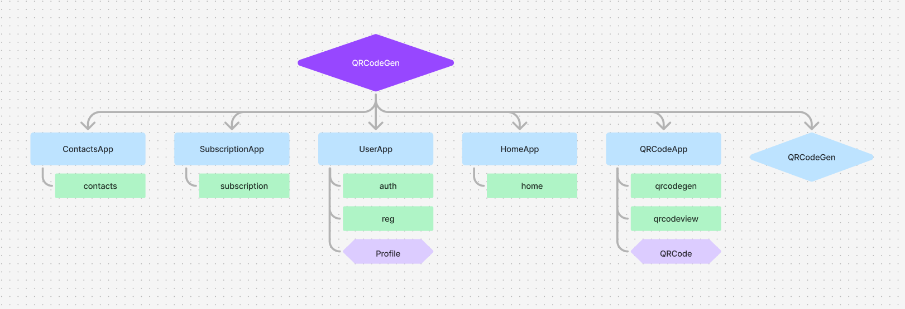

# QR Kent: QRCode Generator

## Наша команда

- Oleksandr Sakharov (https://github.com/SaschaOl) Team lead
- Anna Safonova (https://github.com/AnnaSafonova30)
- Sviatoslav Martynenko (https://github.com/SviatMartynenko)
- Gleb Tkachuk (https://github.com/Gleb-Tkachuk)

## Про проект

Цей проект, це веб-застосунок, який надає послуги зі створення кастомізованих qr-кодів. Він був створений нами з метою вивчання нових технологій, та покращення навичок програмування і веб-розробки.

## Головні технології задіяні в проекті

- Python - осоновна мова програмування проекту
- Django - фреймворк пайтону, що дозволяє створювати веб-застосунки та працювати з бек-ендом
- JavaScript - задіяний для фронт - енду
- HTML
- CSS

## Дизайн веб-застосунку

Посилання на Figma з повним дизайном веб-застосунку, розроблений нами:
https://www.figma.com/design/q83AkLZQPCeqp4ANzKR4sJ/Untitled?node-id=0-1&p=f&t=WsZ2uRINz5X4lMDM-0

## Встановлення та запуск

```python
git clone https://github.com/SaschaOl/QrCode_Generator.git
pip install -r requirements.txt
cd QRCodeGen
python manage.py makemigrations
python manage.py migrate
python manage.py runserver
```

## Поглиблений розбір

### Структура Прокту



---

<details>
<summary>QRCodeGen</summary>
<br>

`QRCodeGen` Це головна папка проекту. Вона містить файл `settings` з усіма налаштуваннями застосунку, а також файл `urls`, де з'єднуются всі застосунки

</details>

<details>
<summary>HomeApp</summary>
<br>

HomeApp відповідає за домашню сторінку веб-застосунку, на якій містится основна інформація про сервіс, та з якої можна легко потрапити на інші сторінки

</details>

<details>
<summary>QRCodeApp (Створення QR-кодів)</summary>
<br>

QRCodeApp відповідає за всі сторінки, та функціонал, пов'язаний безпосередньо з qr-кодами, а також за створення моделі в базі данних для збереження qr-кодів

На сторінці qrcodegen знаходится форма для створення qr-коду. Користувач має задати назву, опис, та самі данні, під які він хоче створити qr-код, а також можна задати кастомізацію, як зміна кольору та додавання логотипу на qr-код. Після натискання на кнопку "Згенерувати", користувачу представляєтся попередньій перегляд qr-коду, після чого він може натиснути "Зберегти", зберегти qr-код.

На серверній стороні при натиску на кнопку "Згенерувати" створюєтся qr-на основі данних з форми, для цього використовюєтся модуль qrcode. Після створення він передаєтся на сторінку і далі при натиску на кнопку "Зберегти" створюєтся запис в базі данних для цього qr-коду, який потім підв'язуєтся до користувача, що його створив по зв'язку OneToMany.

На сторінці qrcodeview користувач може переглянути всі свої збережені qr-коди та подивитися детальну інформацію про них. Також він може видаляти qr коди, та завантажувати саме зобараження qr-коду на свій прилад.

Перенапрямування по qr-кодам влаштовано через посередництво веб-застосунку для запобігання використання недійсних qr-кодів. В першу чергу qr-код створюєтся не з посиланням на данні від користувача, а з посиланням на перенапрямовуючу сторінку для цього qr-коду. На цій перенапрямовуючій сторінці проходить перевірка дійсності qr-коді і в тільки випадку його дійсності проходить перенапрямування по користувацькому посиланню. Якщо qr-код не є дійсним, то користувачеві це повідомляєтся через помилку.

</details>

<details>
<summary>UserApp</summary>
<br>

UrerApp відповідає за сторінки та процеси пов'язані з управлінням акаунтом, а також за створення моделі в базі данних для зберігання зареєстрованих акаунтів.

Коли користувач вперше заходить в веб-застосунок, йому не доступні основні його функції, поки він не увійде в акаунт. Якщо акаунта не маєтся, то його треба створити, для цього треба натиснути на кнопку "Реєстрація" на верхній панелі, що перекине користувача на форму, заповнивши і підтвердивши яку до бази данних користувачів додастся новий запис.

Після підтвердження реєстрації, користувача автоматично перекине на сторінку авторизації, де він зможе увійти в щойно створений акаунт. Після цього кнопка "Реєстрація" на верхній панелі замінится на ім'я поточного користувача, а також з'явится кнопка виходу, натиснувши на яку, користувача викине з поточного акаунту.

</details>

<details>
<summary>SubscriptionApp</summary>
<br>

SubscriptionApp відповідає за сторінку вибору плану підписки, та за його оформлення.

Данні про план підписку зберігаются в об'єкті користувача в базі данних. Залежно від плану змінюєтся кількість qr-кодів, яку користувач може створити, що перевіряєтся під час створення кожного нового qr-коду. Якщо кількість збережених qr-кодів первищує ліміт поточного плану підписки, то зберегти новий не буде можливим. 

</details>

<details>
<summary>ContactsApp</summary>
<br>

ContactsApp відповідає за сторінку контактів, на якій можна подивитись контактні данні служби підтримки сайту, та відправити на неї електронного листа.

</details>

## Висновки

Робота над нашим першим проектом Django дала нам набагато краще розуміння цього фреймворку і тепер ми можемо з більшою легкістью створювати свої подібні веб-застосунки. Найбільше ми просунулись в обробці http запитів та роботі з моделями бази данних. Також ми розібрались в принципі роботи qr-крдів, та самі навчились їх створювати.

Що до подальших перспектив, то цей проект ще можна покращувати та розвивати у відносно різних напрямках, так як він ще досі досить сирий і має тільки основний функціонал.